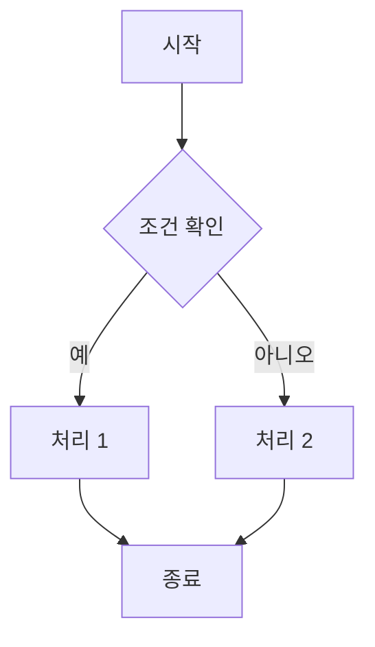

이 문서는 블로그에서 사용할 수 있는 모든 마크다운 문법을 테스트하고 확인하기 위한 가이드입니다.

## 제목 (Headings)

마크다운에서는 6단계의 제목을 사용할 수 있습니다.

# H1 제목
## H2 제목
### H3 제목
#### H4 제목
##### H5 제목
###### H6 제목

---

## 강조 (Emphasis)

텍스트를 강조하는 다양한 방법들:

- **굵은 글씨 (Bold)** 또는 __굵은 글씨__
- *기울임 (Italic)* 또는 _기울임_
- ***굵은 기울임*** 또는 ___굵은 기울임___
- ~~취소선 (Strikethrough)~~

---

## 목록 (Lists)

### 순서 없는 목록

- 항목 1
- 항목 2
  - 중첩된 항목 2.1
  - 중첩된 항목 2.2
    - 더 깊은 중첩 2.2.1
- 항목 3

### 순서 있는 목록

1. 첫 번째 항목
2. 두 번째 항목
3. 세 번째 항목
   1. 중첩된 항목 3.1
   2. 중첩된 항목 3.2
4. 네 번째 항목

### 체크박스 목록

- [x] 완료된 작업
- [x] 구현 완료
- [ ] 진행 중인 작업
- [ ] 예정된 작업

---

## 링크 (Links)

- [일반 링크](https://www.google.com)
- [제목이 있는 링크](https://www.google.com "Google 홈페이지")
- <https://www.google.com>
- [상대 경로 링크](/about)

---

## 인용문 (Blockquotes)

> 이것은 인용문입니다.
>
> 여러 줄로 작성할 수 있습니다.

> **중첩된 인용문:**
>
> > 이렇게 중첩할 수도 있습니다.
> >
> > > 더 깊게 중첩도 가능합니다.

---

## 코드 (Code)

### 인라인 코드

문장 안에 `const variable = "value";` 이렇게 코드를 삽입할 수 있습니다.

### 코드 블록

#### JavaScript

```javascript
function greeting(name) {
  console.log(`Hello, ${name}!`);
  return `Welcome to ${name}'s blog`;
}

const result = greeting("ChangWoo");
console.log(result);
```

#### TypeScript

```typescript
interface User {
  id: number;
  name: string;
  email: string;
}

const createUser = (user: User): User => {
  console.log(`Creating user: ${user.name}`);
  return user;
};

const newUser: User = {
  id: 1,
  name: "ChangWoo",
  email: "changwoo@example.com"
};
```

#### Python

```python
def fibonacci(n):
    """피보나치 수열 생성"""
    if n <= 1:
        return n
    return fibonacci(n-1) + fibonacci(n-2)

# 리스트 컴프리헨션
numbers = [fibonacci(i) for i in range(10)]
print(numbers)
```

#### CSS

```css
.container {
  display: flex;
  justify-content: center;
  align-items: center;
  background-color: #f0f0f0;
  padding: 2rem;
  border-radius: 8px;
}

.title {
  font-size: 2rem;
  font-weight: bold;
  color: #333;
}
```

#### JSON

```json
{
  "name": "DevBlog",
  "version": "1.0.0",
  "description": "A modern blog built with Next.js",
  "dependencies": {
    "next": "^16.1.0",
    "react": "^19.2.3"
  }
}
```

#### Bash

```bash
#!/bin/bash

# 디렉토리 생성 및 파일 생성
mkdir -p project/src
cd project

# Git 초기화
git init
git add .
git commit -m "Initial commit"

# 서버 실행
npm install
npm run dev
```

---

## 테이블 (Tables)

### 기본 테이블

| 제목 1 | 제목 2 | 제목 3 |
|--------|--------|--------|
| 셀 1-1 | 셀 1-2 | 셀 1-3 |
| 셀 2-1 | 셀 2-2 | 셀 2-3 |
| 셀 3-1 | 셀 3-2 | 셀 3-3 |

### 정렬된 테이블

| 왼쪽 정렬 | 가운데 정렬 | 오른쪽 정렬 |
|:----------|:-----------:|------------:|
| Left      | Center      | Right       |
| 왼쪽      | 가운데      | 오른쪽      |
| 1         | 2           | 3           |

### 복잡한 테이블 예시

| 언어 | 프레임워크 | 난이도 | 인기도 |
|------|-----------|--------|--------|
| JavaScript | React | ⭐⭐⭐ | 🔥🔥🔥🔥🔥 |
| TypeScript | Next.js | ⭐⭐⭐⭐ | 🔥🔥🔥🔥 |
| Python | Django | ⭐⭐ | 🔥🔥🔥 |
| Go | Gin | ⭐⭐⭐ | 🔥🔥🔥🔥 |

---

## 이미지 (Images)

### 기본 이미지


### 이미지에 링크 추가

[](https://www.google.com)

---

## 수평선 (Horizontal Rules)

세 가지 방법으로 수평선을 만들 수 있습니다:

---

***

___

## 이스케이프 (Escape)

특수 문자를 표시하려면 백슬래시를 사용합니다:

\* 별표
\_ 언더스코어
\# 해시
\[ 대괄호
\] 대괄호
\( 소괄호
\) 소괄호

---

## 각주 (Footnotes)

이것은 각주가 있는 문장입니다[^1].

여기에 또 다른 각주가 있습니다[^2].

[^1]: 이것은 첫 번째 각주의 내용입니다.
[^2]: 이것은 두 번째 각주의 내용입니다. 여러 줄로 작성할 수도 있습니다.

---

## 정의 목록 (Definition Lists)

Term 1
: 정의 1

Term 2
: 정의 2a
: 정의 2b

---

## HTML 태그

마크다운 안에서 HTML을 사용할 수도 있습니다:

<div style="background-color: #f0f0f0; padding: 1rem; border-radius: 8px; margin: 1rem 0;">
  <strong>HTML 박스</strong>
  <p>이것은 HTML로 작성된 박스입니다.</p>
</div>

<details>
<summary>클릭해서 펼치기</summary>

이것은 숨겨진 내용입니다!

- 항목 1
- 항목 2
- 항목 3

</details>

---

## 수식 (Math - LaTeX)

인라인 수식: $E = mc^2$

블록 수식:

$$
\frac{n!}{k!(n-k)!} = \binom{n}{k}
$$

$$
\sum_{i=1}^{n} i = \frac{n(n+1)}{2}
$$

---

## 작업 흐름도 (Mermaid Diagram)



---

## 특수 문자와 이모지

### 이모지

😀 😃 😄 😁 😆 😅 🤣 😂
🔥 💻 📱 🚀 ⭐ ✨ 💡 📝
✅ ❌ ⚠️ 🎯 🏆 🎉 🎊 🎈

### 특수 기호

© ® ™ § ¶ † ‡
← → ↑ ↓ ↔ ↕
≈ ≠ ≤ ≥ ± ∞

---

## 키보드 입력

<kbd>Ctrl</kbd> + <kbd>C</kbd>
<kbd>Ctrl</kbd> + <kbd>V</kbd>
<kbd>Cmd</kbd> + <kbd>Shift</kbd> + <kbd>P</kbd>

---

## 약어 (Abbreviations)

HTML, CSS, JS는 웹 개발의 기본입니다.

*[HTML]: Hyper Text Markup Language
*[CSS]: Cascading Style Sheets
*[JS]: JavaScript

---

## 복합 예제

### 코드와 설명이 함께

다음은 React 컴포넌트의 예시입니다:

```tsx
import React from 'react';

interface Props {
  title: string;
  description: string;
}

export const Card: React.FC<Props> = ({ title, description }) => {
  return (
    <div className="card">
      <h2>{title}</h2>
      <p>{description}</p>
    </div>
  );
};
```

이 컴포넌트는 다음과 같은 특징이 있습니다:

- ✅ TypeScript로 작성
- ✅ Props 타입 정의
- ✅ 함수형 컴포넌트
- ✅ 재사용 가능한 구조

### 테이블과 코드 조합

| 메서드 | 설명 | 예시 |
|--------|------|------|
| `map()` | 배열을 변환 | `arr.map(x => x * 2)` |
| `filter()` | 배열을 필터링 | `arr.filter(x => x > 5)` |
| `reduce()` | 배열을 축소 | `arr.reduce((a, b) => a + b)` |

---

## 마무리

이 문서는 블로그에서 사용 가능한 모든 마크다운 문법을 포함하고 있습니다.

> **팁:** 실제 작성 시에는 이 문서를 참고하여 필요한 문법을 적용하세요!

**주요 포인트:**

1. 마크다운은 간단하면서도 강력합니다
2. HTML과 함께 사용할 수 있습니다
3. 코드 하이라이팅을 지원합니다
4. 다양한 확장 문법을 제공합니다

---

**작성일:** 2025-01-15
**작성자:** ChangWoo
**카테고리:** Tech
**태그:** #Markdown #Guide #Documentation
